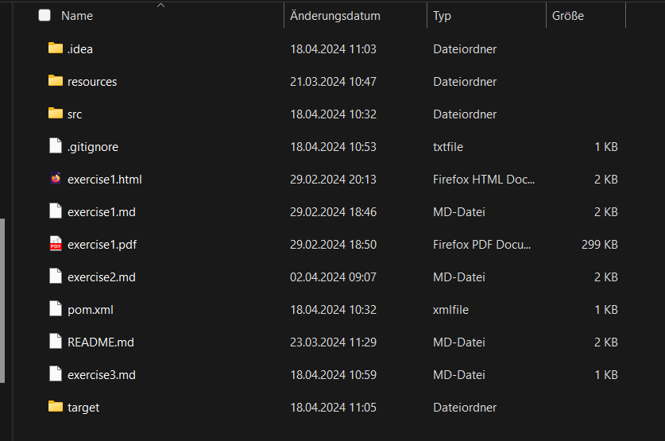
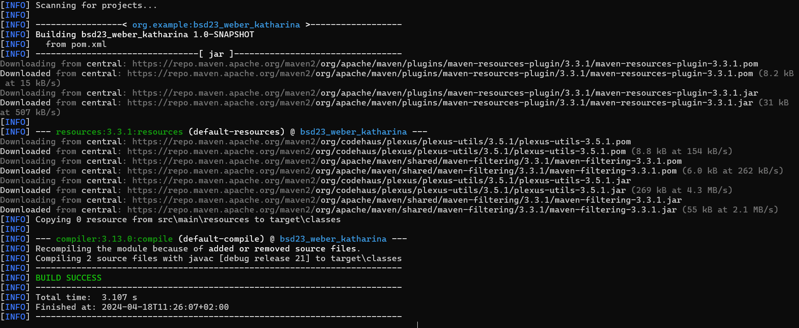
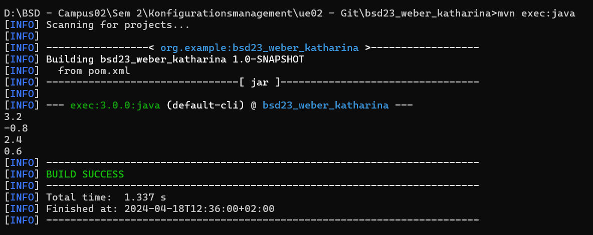

# Exercise 3
## Description
Java Project with Maven.

## Used versions
#### Maven
```bash
Apache Maven 3.9.6 (bc0240f3c744dd6b6ec2920b3cd08dcc295161ae)
Maven home: C:\Program Files\apache-maven-3.9.6
Java version: 21.0.1, vendor: Oracle Corporation, runtime: C:\Program Files\Java\jdk-21
Default locale: de_AT, platform encoding: UTF-8
OS name: "windows 11", version: "10.0", arch: "amd64", family: "windows"
```

#### Java
```bash
java version "21.0.1" 2023-10-17 LTS
Java(TM) SE Runtime Environment (build 21.0.1+12-LTS-29)
Java HotSpot(TM) 64-Bit Server VM (build 21.0.1+12-LTS-29, mixed mode, sharing)
```

#### Javac
```bash
javac 21.0.1
```

## File structure


#### Description
Resources was created
Here you can see the file structure of a java project. .gitignore ignores the mentioned Files when working with Git.
In src is the Source-Code located, in resources are the used pictured from the different exercise.md. 


## Successful Builds
### 1.

### 2.



